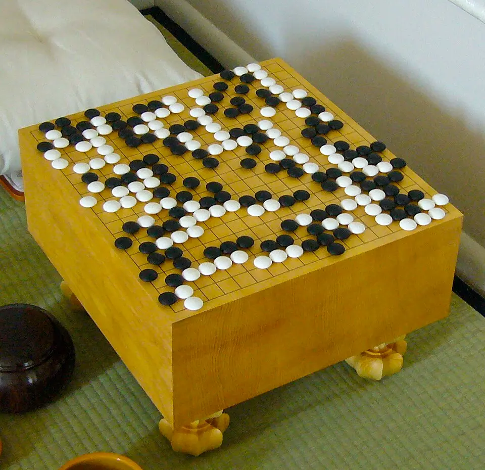
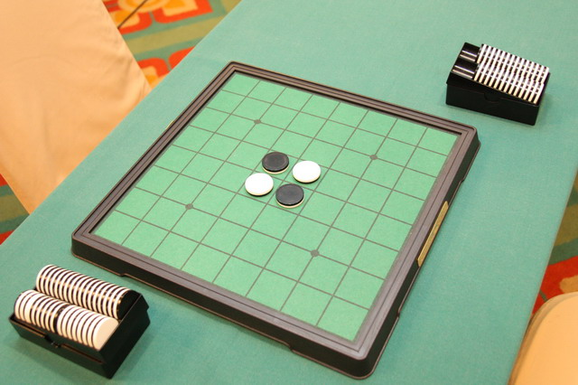
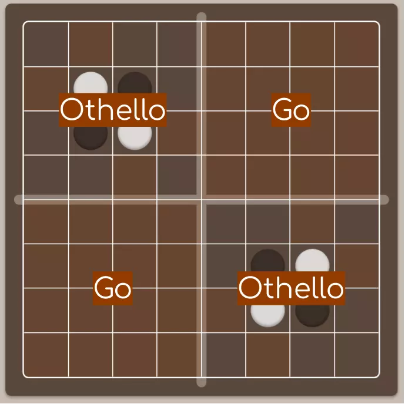
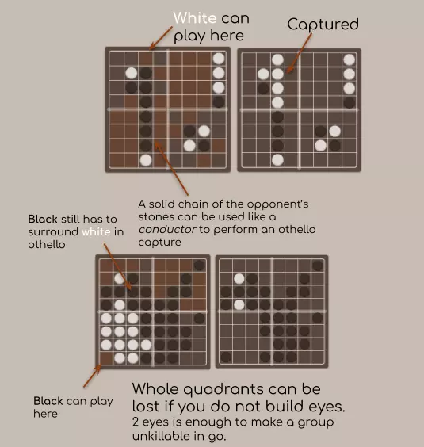

What if Othello and Go were mixed? They share lots of similarities so it must be possible right? As part of the *Smoke and Mirrors paper* at the University of Waikato, me and one other student created a mashup strategy game combining the game of Othello and Go. Our end product was a web application and was playable online. I worked on the Java server and a ReactJS client while my teammate worked on coding the rules.

If you would like to play it, it is available at https://github.com/tachyonicClock/gothello you'll need to know how to use docker.

## Go

For those that do not know the game of Go is one of the earliest board games invented over 2,500 years ago in China. It is thought to be the oldest game continuously played to the present day. It is a longer game about gradually capturing territory while trying to stop the other player from doing the same. The game is played in turns with each player playing one stone, or piece of there colour. The pieces join into a group when they are placed next to each other. When a group is surrounded by the opponents' stones, it is captured, removing them from play. The winner is determined by the player who controls the most territory and has captured the most pieces.

## Othello

Othello is much simpler. It is again played in turns where each player places a piece of there colour on a grid. The stones must be placed so that two of your colour are sandwiching a line of the opponents pieces. The line of pieces is then flipped so that they are all your colour. In this manner, the game is played until no more pieces may be played on the board. Othello is a much more dynamic game where it is often unclear who is winning and fortunes can change quickly.

## Comparisons

Go and Othello are interesting foils to each other. Both are played with relatively simple rules that create a deep game. The game of Go, however, is much more complex, with people claiming it is the most complex game in the world because of its vast number of permutations. Othello, on the other hand, has many fewer permutations. The complexity is manifest in the average times that the games take to play with professional Go games taking hours to be played by professionals. Whereas Othello is played in ten or so minutes or less. The complexity of the games and pace is one of the key conflicts when it came to combing the games. Othello could end up dominating the slower-paced Go.

From a game theory perspective, the two games share lots of traits:

- **Two-player**

- **Zero-sum**, meaning there is only one winner. Every victory comes at the expense of the opponent. 

  - Monopoly is a zero-sum game where to win someone else must lose. 
  - Real-life is not a zero-sum game

- **Perfect-information**, no information is hidden as both players can see the same board

  - Battleships is not perfect-information.
  - Chess is perfect-information.

- **Partisan**, both players can make different moves

  - A lottery is an impartial game (all players can make the same moves I buy a ticket)
  - Chess is a partisan

- **Deterministic**, no chance is involved

  - Chess is deterministic
  - Uno is not deterministic

They are also both played with the same sort of pieces on a grid. The fact that they are so similar makes combining them much simpler and more organic. For example, imagine if UNO was combined with chess it would be kind of strange since they are very fundamentally dissimilar to each other.  It is possible a game combining chess and UNO could work it just does not make intuitive sense. Not only are they played with different pieces, different number of players, only one is deterministic, and only one is perfect information. This shows logically how Go and Othello are good fits for each other.

Asking what games make good matches gets us some interesting pairings. For example Chess and Go or connect 4 and checkers. All of these games are two player, zero-sum, deterministic, and perfect-information. Or UNO and Monopoly both being multi-player, imperfect-information, partisan and not deterministic. This pairing makes more intuitive sense and might even be fun. Of course the reverse is interesting which games are very different?

### Rejected Concepts

#### Hybrid game concept

In the Hybrid game concept*,* after each Go-style capture, the capturing player could place one piece with the rules of Othello. This idea was interesting because it offered the prospect of a big upset where the Othello placements transformed the game board.

We had to reject this idea because we felt it would unfairly advantage the winning player. We then toyed with flipping the rule on its head. Instead of awarding the Othello move to the capture, we would give it to the captured, as a way to balance the game. The ruleset was rejected because we felt like this game would end quickly. It would encourage players to avoid capturing pieces, leading to a dull game.

#### Reversed Captures Concept

While researching, we discovered that Portland State Universities computer science department had already invented a game that they called Gothello (http://web.cecs.pdx.edu/~bart/cs541-fall2001/project/gothello.html ). The concept is the same as Go except instead of capturing stones they are converted. Portland State University's Gothello used a small 5x5 board. We rejected this concept because we felt it did not really feel like Othello. Instead, it was a minor change to Go. Additionally, we wanted to create something original.

#### Limited Othello Concept

Our observation of the relative power of Othello vs Go led to the development of the concept of limited Othello. In this concept, we would give both players n pieces that they can use as Othello pieces. The pieces would then have to be used wisely to win the game. We felt this could lead to players being able to turn the tide of the game. In our minds, this was a strong concept.

#### Madness

Sometimes it is interesting to think about what the worst idea could be, this led to our madness concept. With this idea, both of the games’ rules always apply. Each move would be treated as both a Go move and an Othello move. This would create a very chaotic and confusing game board. Additionally, we felt that the Othello moves would overpower Go and led us to believe that the game would end up being Othello with some weird rules.

## Combining them

In the end, we decided upon a simple concept: we would divide the board into sections. This idea involved subdividing the whole 8x8 board into 4 4x4 sub-boards. In each of these sub-boards, a different rule set would apply.

This was an intriguing idea because of how the borders between sub-boards would interact. A Go move could have a game-changing effect on the Othello board and vice-versa. For example, a Go move could flip a line in an Othello game or an Othello move could help capture some Go stones.

Later as we developed the game concept, we would discover what we came to call conduction. Conduction is when a Go-style move is played in the Go section but is conducted into the Othello sections. Or vice-versa, where the Othello board could remove the liberties of a Go shape. One of the fascinating aspects of this project was that lots of these ideas and interactions arose organically rather than being explicitly planned. These mechanics result in some fascinating games that you won't really appreciate unless you play the game. 

